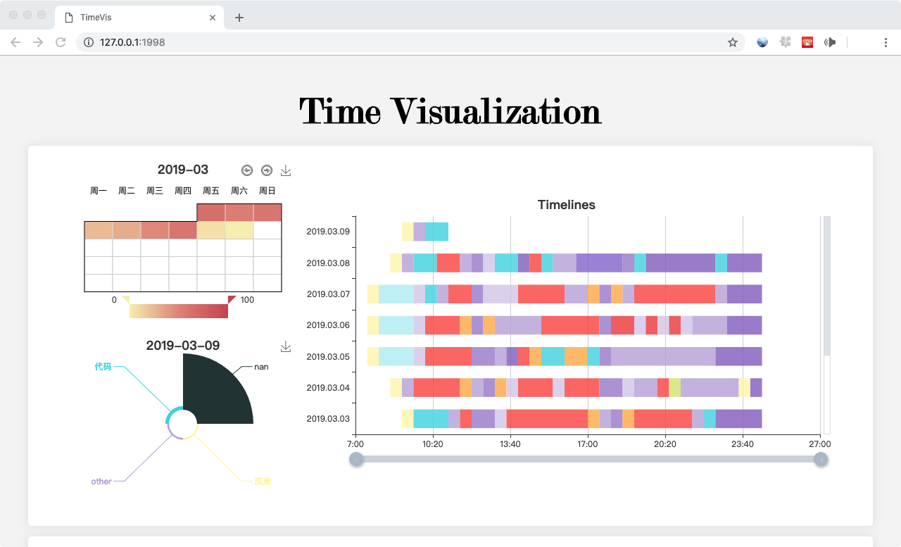

# TimeVis
A simple time visualization website.



### There are four charts included:
- Calendar Chart

    This is a heatmap which you can see the
    proportion of your study time every day.
- Pie Chart

    This chart shows the proportion of time that you spent on each projects.

- Stacked Bar Chart

    Record your time in detail.

- Stacked Area Chart

    All about your time. Whatever, I have no idea what to write.

### Requirements & Installation

- Python3

```bash
cd YourWorkSpace
git clone https://github.com/Xiaoyuan-Shen/TimeVis.git
python3 main.py
```


### Other
- You can use the color cards on this website to find the color you want. https://www.materialui.co/colors
